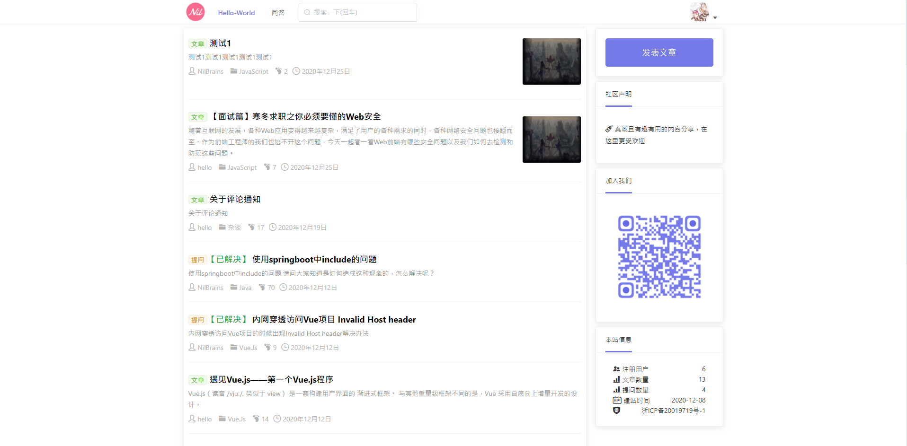
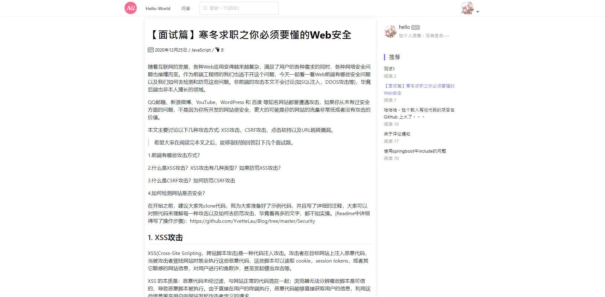
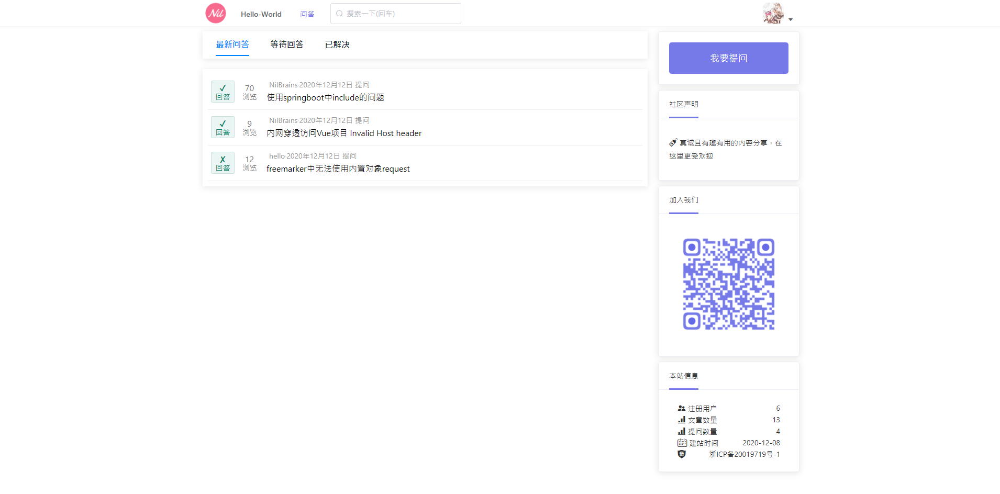

# graduation_project

## zero

我的毕业设计。

本来是想着写一博客系统的，后来写着写着就变成了一个“四不像”——介于博客和社区之间的一个东西。

## start

> 数据库名称为 `graduation`

结构：

- graduation_admin 后台管理页面 (vue)
- graduation_web 前台页面 (vue)
- graduation_server 后台api (Java)

### 1. graduation_admin

基于`vue-admin-template`编写

```bash
# 进入项目目录
cd graduation_admin

# 安装依赖
npm install

# 建议不要直接使用 cnpm 安装以来，会有各种诡异的 bug。可以通过如下操作解决 npm 下载速度慢的问题
npm install --registry=https://registry.npm.taobao.org

# 启动服务
npm run dev
```

### 2. graduation_web

貌似基于原生模板编写

启动方法 与上述一致。

### 3. graduation_server

使用框架`SpringBoot`编写。

- 创建admin用户

```java
    // 初始化 管理员账号
    @PostMapping("/user/admin_account")
    public ResponseResult initManagerAccount(@RequestBody User user, HttpServletRequest request) {
        return userService.initManagerAccount(user, request);
    }
```

- 由代码 => postwoman 发个请求 就OK了。

> 具体参数 请阅读源码
>
> 源码阅读后 自然知晓
> > tip: 如果没有清空数据库的话 那么 nilbrains - 123456

## show





